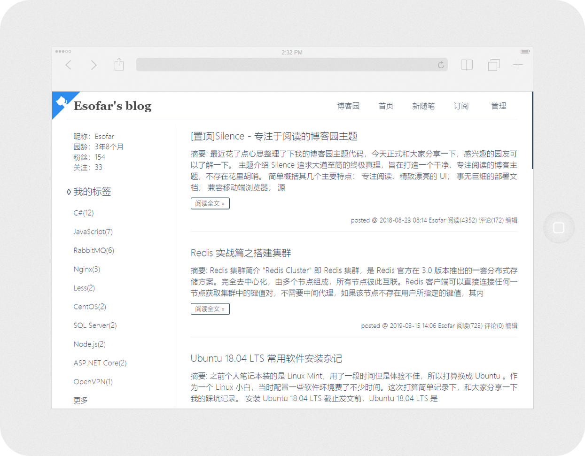
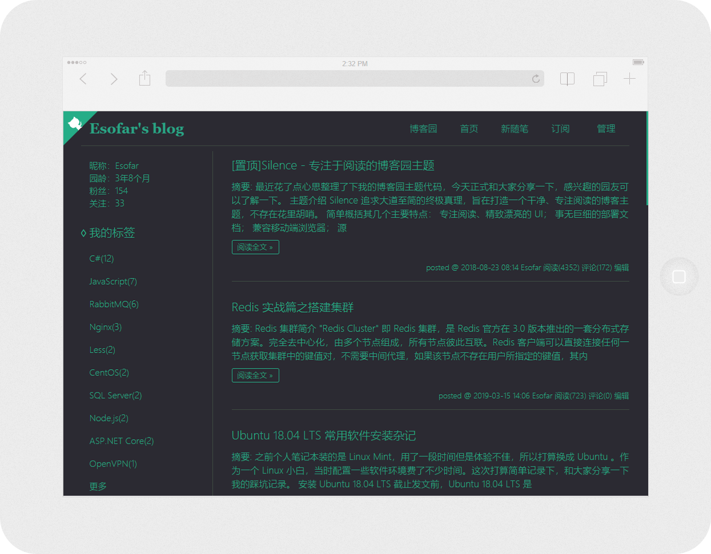
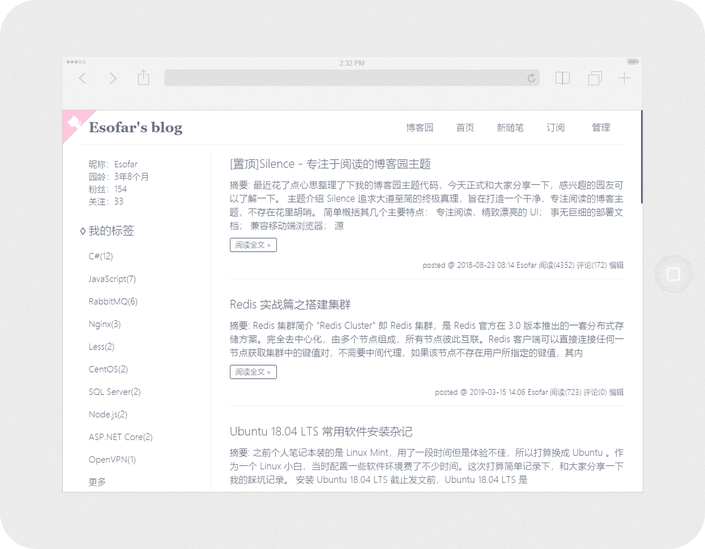
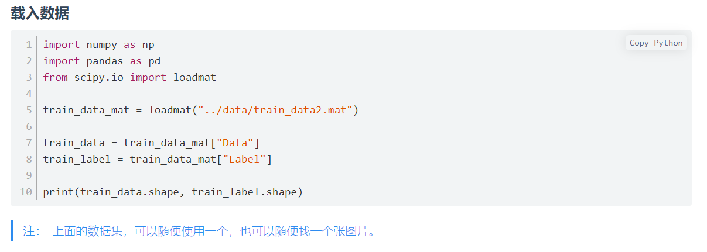
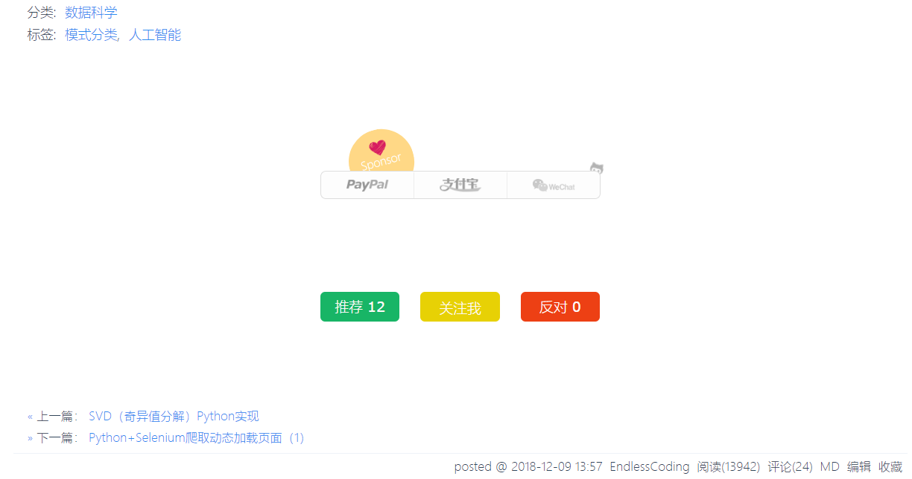
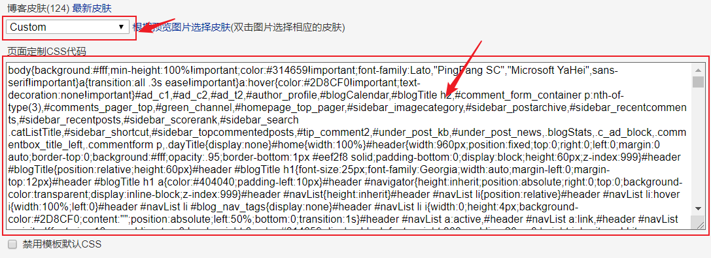
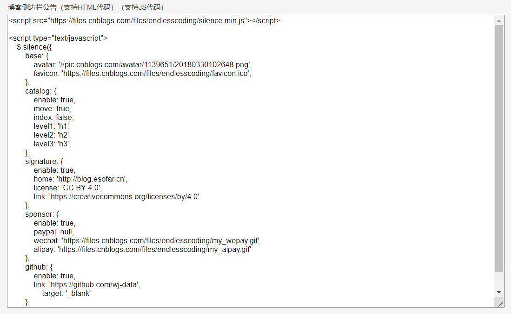
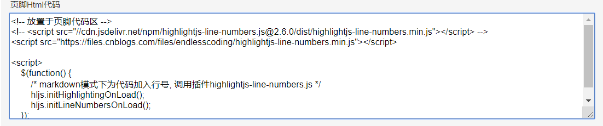
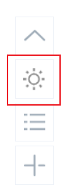
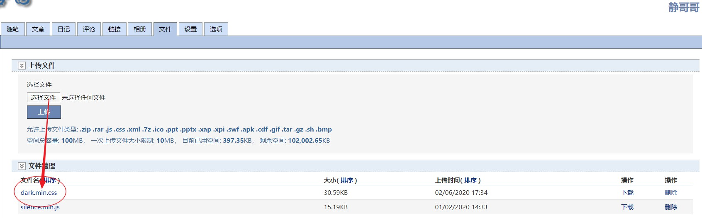

## 1. 一款专注于阅读的[博客园](https://www.cnblogs.com/)主题

> 本主题基本于[esofar/cnblogs-theme-silence](https://github.com/esofar/cnblogs-theme-silence)的开源项目，做得非常不错，我[这里](https://gitee.com/edata-code/SimpleCnblogTheme)我只是对它做了一些非常小的更改。效果预览：[我的博客](https://www.cnblogs.com/endlesscoding/p/10090866.html)

* 添加代码行号显示
* 添加关注按钮
* 细节上的修改

可以在[我的博客](https://www.cnblogs.com/endlesscoding/p/10090866.html)查看效果，这里简单展示一下。

原始的风格如下：
<div align="center">

简约 · 蓝



暗黑 · 绿



女神 · 粉



</div> 


代码行号显示，并显示代码类型：


添加关注我的按钮：


## 2.使用本主题

> 这里仅简单介绍，详细参考[这个文档](docs/deploy.md)，或者[原部署文档](https://github.com/esofar/cnblogs-theme-silence/blob/master/docs/deploy.md).

### 2.1 添加样式文件

进入博客园[设置页面](https://i.cnblogs.com/Configure.aspx)，博客皮肤选择`Custom`，再将主题样式文件[默认](dist/themes/default.min.css)、[黑色](dist/themes/dark.min.css)、[粉色](dist/themes/goddess.min.css)中的代码复制到`页面定制CSS代码`框中：


### 2.2 添加js文件

上面完成后，在`侧边栏公告`中添加如下js代码，请按需更改成你[自己的](docs/deploy.md)

```html
<script src="https://files.cnblogs.com/files/endlesscoding/silence.min.js"></script>
 
<script type="text/javascript">
    $.silence({
	base: {
            avatar: '//pic.cnblogs.com/avatar/1139651/20180330102648.png',
            favicon: 'https://files.cnblogs.com/files/endlesscoding/favicon.ico',
        },
        catalog: {
            enable: true,
            move: true,
            index: false,
            level1: 'h1',
            level2: 'h2',
            level3: 'h3',
        },
        signature: {
            enable: true,
            home: 'http://blog.esofar.cn',
            license: 'CC BY 4.0',
            link: 'https://creativecommons.org/licenses/by/4.0'
        },
        sponsor: {
            enable: true,
            paypal: null,
            wechat: 'https://files.cnblogs.com/files/endlesscoding/my_wepay.gif',
            alipay: 'https://files.cnblogs.com/files/endlesscoding/my_aipay.gif'
        },
        github: {
            enable: true,
            link: 'https://github.com/wj-data',
	        target: '_blank'
        }
    });
</script>
```



此外还需要在页脚html代码中添加如下代码，这个代码主要是用显示代行号。

```html
<!-- 放置于页脚代码区 -->
<script src="https://files.cnblogs.com/files/endlesscoding/highlightjs-line-numbers.min.js"></script>
<script src="https://files.cnblogs.com/files/endlesscoding/jquery.cookie.min.js"></script>

<script>
    $(function() {
        /* markdown模式下为代码加入行号, 调用插件highlightjs-line-numbers.js */
        hljs.initHighlightingOnLoad();
        hljs.initLineNumbersOnLoad();
    });
</script>
```



## 3. 自定义功能介绍

* 添加`最近评论`列表，这个对于你查看最近的评论和及时回复有点帮助。


* 添加`夜间模式`和`日间模式`按钮，可切换深色阅读和浅色阅读模式。

要实现这个功能，除了要添加上面的的[silence.js](dist/silence.min.js)文件外，还需要将[dark.min.css](dist/themes/dark.min.css)文件添加到你博客的

<table style="text-align:center">
    <tr>
        <td width="80"></td>
        <td></td>
    </tr>
    <tr>
        <td>主题切换按钮</td>
        <td>主题文件上传</td>
    </tr>
</table>
