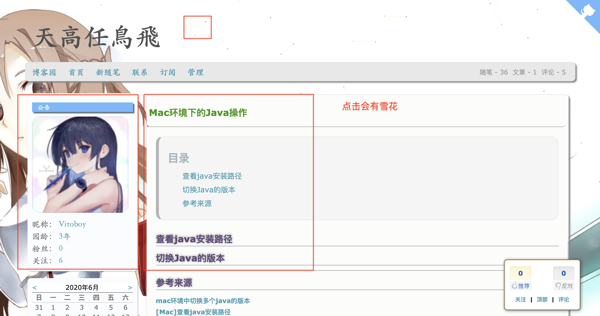
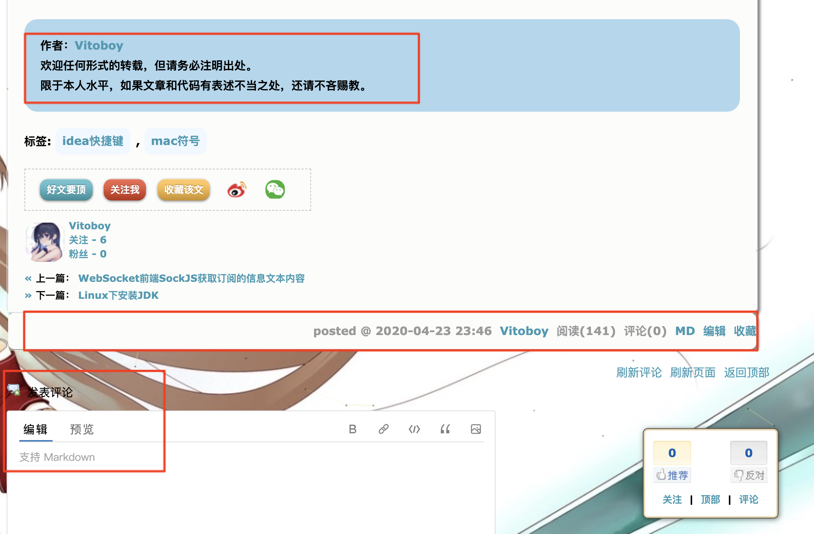
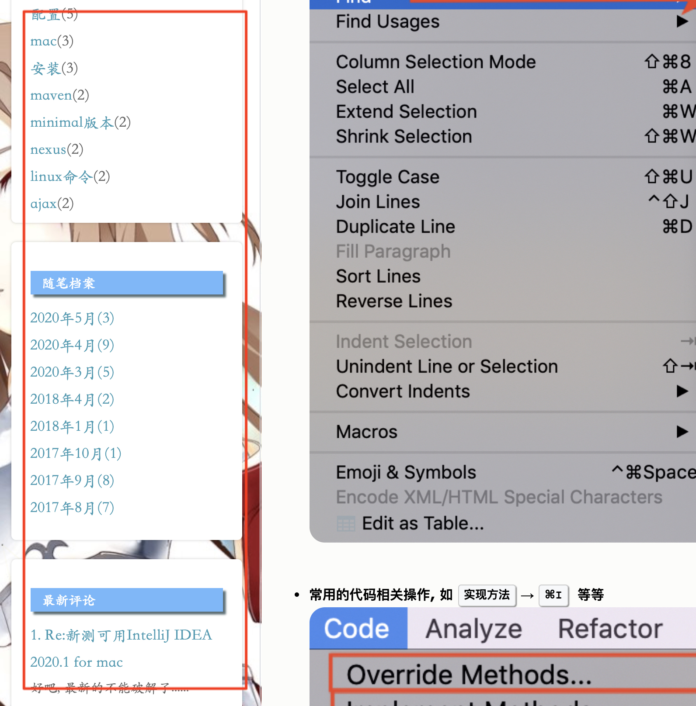

# cnblog(博客园)主题

## 自己设置过的炫酷主题

首页

标题

博客底部

博客侧边消息等

 

* 自己也是参考很多人的代码合成的, 但总感觉不行, 不够简约

  * 如果觉得上面的题还不错, 可以参考`${root_dir}/code/readme.md`, 里面有操作说明

* 所以, 这次我换成下面的主题**简约博客主题**

  

 
 

## 简约的主题

这个是主题的所有设置, 都在`${root_dir}/reference/`目录下, 已经打包好, 解压后, 参照里面的说明操作即可, 废话不多说, 看效果如下: (更多关于这主题的说明, 请看`MORE_GOOD_THEMES.md`)

简约 · 蓝

暗黑 · 绿

女神 · 粉

 

怎么样, 不错吧, 一起来试试~~

 
 

----

## 参考来源

[简约博客园主题(Cnblog Theme)](https://gitee.com/edata-code/SimpleCnblogTheme)