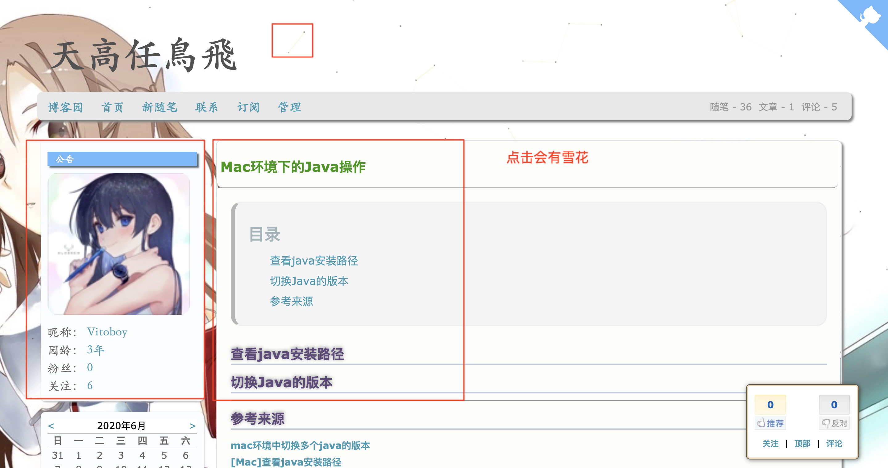
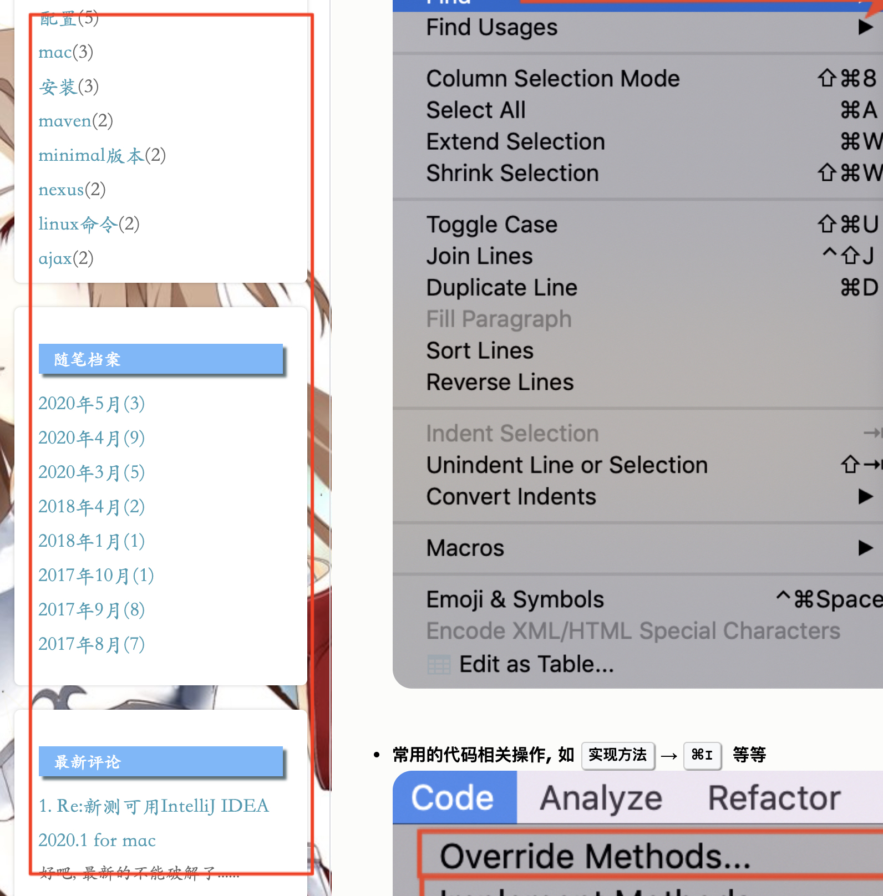

# cnblog(博客园)炫酷主题设置

## 炫酷主题展示

* 首页

* 标题

* 博客底部

* 博客侧边消息等

 
 

## 主题设置

* 到目录`${root_dir}/code/original_code/`下, 将里面的`.css`和`.js`文件上传到自己的cnblog

  * 有需要的话, 可以按自己的需求编辑, 再上传
  * `cnblog.vito.css`里有设置背景图片的链接
  * `cnblog.min.vito.js`里有设置文章属名

* 从自己博客的首页—>[管理]—>[设置], 开始设置主题

* 博客皮肤可以任意, 但 **需要勾选** `禁用模板默认CSS`

  

* 博客侧边栏公告设置

  * 复制`${root_dir}/code/html_set/cnblog_leftOrRight_nofity_html_code.html`里面的代码到设置框里, 修改头像的链接为自己的即可

  

* 设置页首/页脚的HTML代码

  * 复制`${root_dir}/code/html_set/cnblog_top_html_code.html`里面的代码到页首的设置框里, 修改github的链接为自己的即可
  * 复制`${root_dir}/code/html_set/cnblog_down_html_code.html`里面的代码到页首的设置框里, 修改代码里面各种css/js链接为自己前面上传到自己博客的链接(使用我的链接也可以)

